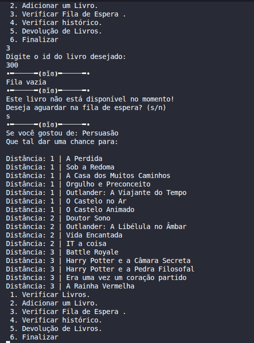

# 📚 Library System (Java)


## 📌 Sobre o projeto

Este projeto é um sistema simples de gerenciamento de biblioteca desenvolvido em Java.  
Ele simula o controle de livros, empréstimos, devoluções, fila de espera e histórico de navegação do usuário.

O objetivo é aplicar estruturas de dados como **Stack (pilha)** e **Queue (fila)** em um cenário prático.

---

## 🚀 Funcionalidades

* Cadastro de livros
* Listagem de livros disponíveis
* Empréstimo de livros
* Devolução de livros
* Sistema de fila de espera (Queue)
* Histórico de navegação do usuário (Stack)
* Validação de ID de livros
* Menu interativo via console

---


## 🧠 Estruturas de Dados e Algoritmos

### 📦 Queue (Fila) e Stack (Pilha)
* Utilizadas para o gerenciamento de usuários em espera e histórico de navegação, respectivamente.

### 🕸️ Grafos (Adjacency List)
* Os livros são tratados como nós em um grafo, onde as arestas representam conexões por **Gênero** ou **Autor**.

### 🛤️ Algoritmo de Dijkstra
* Implementado para calcular a **menor distância** entre dois títulos. Isso permite que o sistema recomende livros não apenas do mesmo autor (Distância 1), mas também livros relacionados por "pontes" de gênero (Distância 2 ou mais), criando uma rede de descoberta orgânica.

---

## 🖼️ Demonstração do Algoritmo

Abaixo, um exemplo do sistema calculando as recomendações para o livro *Persuasão*. Note a navegação do Dijkstra alcançando diferentes níveis de proximidade (Distâncias 1, 2 e 3):




---

## 🏗️ Estrutura do projeto

```
src/
├── application/
│   └── Program.java
├── entities/
│   ├── Livro.java
│   ├── Usuario.java
│   └── Relacionamento.java
```


## ▶️ Como executar

### 1. Clonar o repositório
```bash
git clone https://github.com/aninha-jpg/library-system.git
```
### 2. Acesse a pasta do repositório

```
cd library-system/src
```

### 3. Compile 

```
javac application/Program.java
```

### 4. Execute a classe 

```
java application.Program
```

## 🎯 Objetivo educacional

Este projeto foi desenvolvido com foco em:

* Programação Orientada a Objetos (POO)
* Estruturas de dados (Stack e Queue)
* Simulação de sistema real
* Lógica de fluxo com menu interativo

## 👩‍💻 Tecnologias utilizadas
* Java
* Collections Framework
* IDE: VS Code

---

## ⚙️ Conceitos adicionais utilizados

- Expressões lambda
- Stream API (`stream()`, `filter()`, `findFirst()`)
- Programação funcional básica em Java
- Algoritmo Dijkstra

---

### 📌 Autor

Ana Luiza, Projeto desenvolvido para fins acadêmicos.